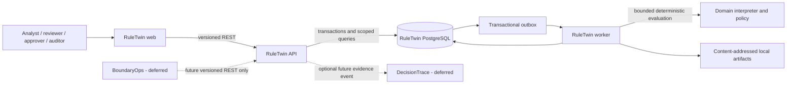

# RuleTwin System Context and Boundaries

## Ownership

RuleTwin owns immutable rule versions, synthetic replay manifests/events, simulations/runs/results, impact deltas, risk policies/evaluations, approvals, release gates, audit events and its outbox. It does not own billing execution, production customer data, another product’s database or autonomous production writes.

## Trust boundaries

- Browser/API: all input and claimed tenant context are untrusted.
- API/database: scoped repositories and transaction boundaries enforce tenant/data invariants.
- Database/outbox/worker: service identity, leases and idempotent state transitions constrain asynchronous execution.
- Worker/interpreter: rule/event JSON is untrusted and bounded by allowlists and resource limits.
- Worker/artifact storage: content checksums plus parent-object authorization protect detailed results.
- Export/telemetry: output is tenant-authorized, bounded and redacted.

The portfolio repository supplies governance only. It is not a runtime dependency. BoundaryOps and DecisionTrace may later consume versioned contracts but never RuleTwin internals or its database.
