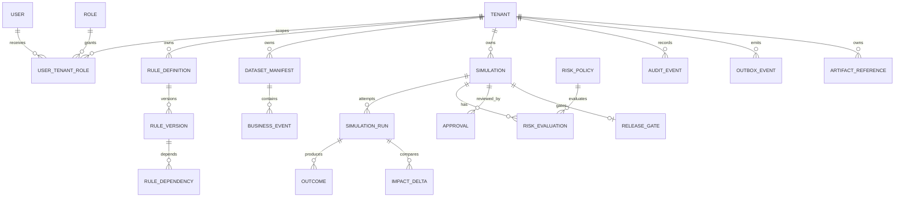

# Data Model and Lifecycle

## Table groups

- Identity: `tenants`, `users`, `roles`, `user_tenant_roles`.
- Rules: `rule_definitions`, `rule_versions`, `rule_dependencies`.
- Replay: `dataset_manifests`, `business_events`, `artifact_references`.
- Execution: `simulations`, `simulation_runs`, `outcomes`, `impact_deltas`.
- Decision: `risk_policies`, `risk_evaluations`, `approvals`, `release_gates`.
- Integrity: `audit_events`, `outbox_events`.

## Integrity and lifecycle

- Tenant ID is required on every tenant-owned key and query path; composite uniqueness includes tenant scope.
- Immutable rows are inserted, never overwritten. Corrections create a new version linked to the superseded version.
- Approval and gate rows reference exact simulation result and policy checksums.
- Application roles have no update/delete privilege on audit records.
- Large bounded result artifacts may move to content-addressed local artifact storage; the database retains tenant, media type, size, checksum, lifecycle state and authorization metadata.
- Retention is policy-driven and explicit. Deletion/expiry of non-audit artifacts leaves a tombstone and audit record; evidence required by a live approval or gate cannot expire.

The Phase 1 schema and retention review is recorded in [`schema-review.md`](schema-review.md). Exact migration syntax, measured query plans and partitioning remain Phase 2 implementation concerns. No migration exists yet.
